# 上课 · ShangKeSchedule

> 一款面向中国高校场景的开源课表 App（Kotlin Multiplatform + Compose Multiplatform）。
> 一个应用解决：**课程表、日程与待办、多作息方案、情侣课表、教务一键导入、桌面小组件、课程提醒与云备份**。
> Android 为正式版本（Android 8.0+），Desktop 与 iOS 正在开发中。


---

## 界面速览

底部四个主页面，从左到右依次为「今日 / 课表 / 日程 / 我的」：

| 今日 | 课表 | 日程 | 我的 |
| --- | --- | --- | --- |
| 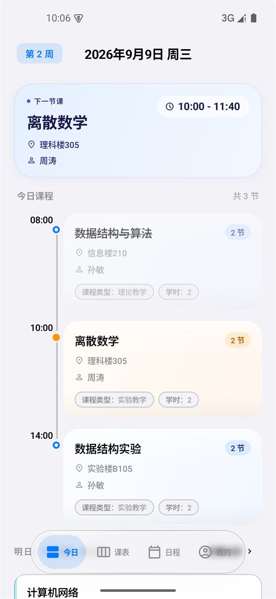 | 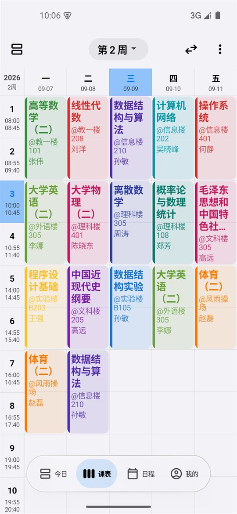 | 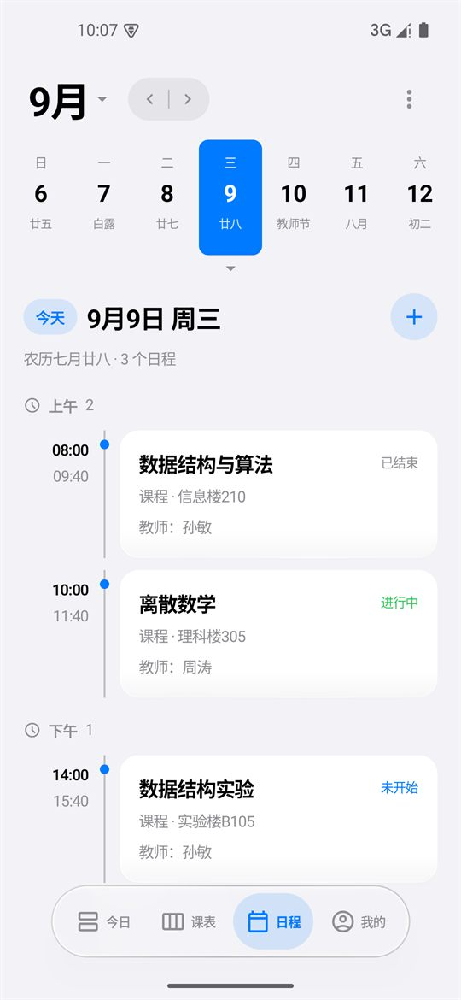 | 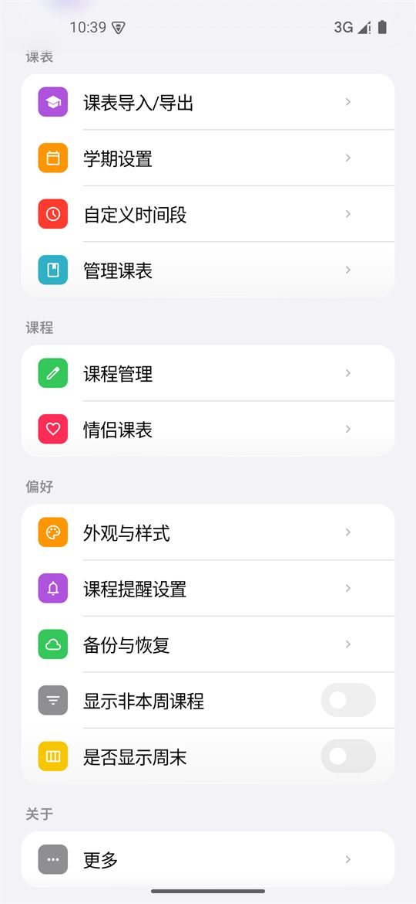 |

- **今日**：日期与周次、下节课 / 正在上课卡片（含起止时间）、今日课程时间轴（区分已结束 / 正在进行 / 未开始）、今日待办与明日预告。
- **课表**：周一至周日网格、左侧节次与时间段、课程彩块；支持左右滑动切换周次、点击顶部周次快速跳转、长按课程块调整。
- **日程**：整月日历 + 日期轴 + 当日时间轴，课程与待办 / 活动 / 考试 / 作业同屏，分类与完成状态一目了然。
- **我的**：设置主入口，按「课表 / 课程 / 偏好 / 关于」四组归类，全部明细功能保留在各二级页。

三套内置主题（书卷 / 通透 / 柔绘）与深色模式：

| 书卷（暖砂纸底 + 赤陶主色） | 柔绘（柔和晕染渐变） | 深色模式 |
| --- | --- | --- |
| 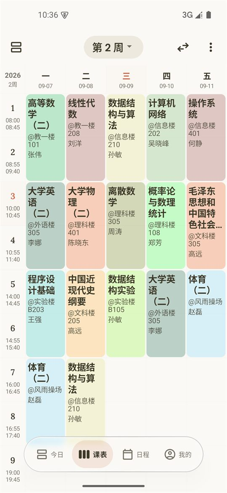 | 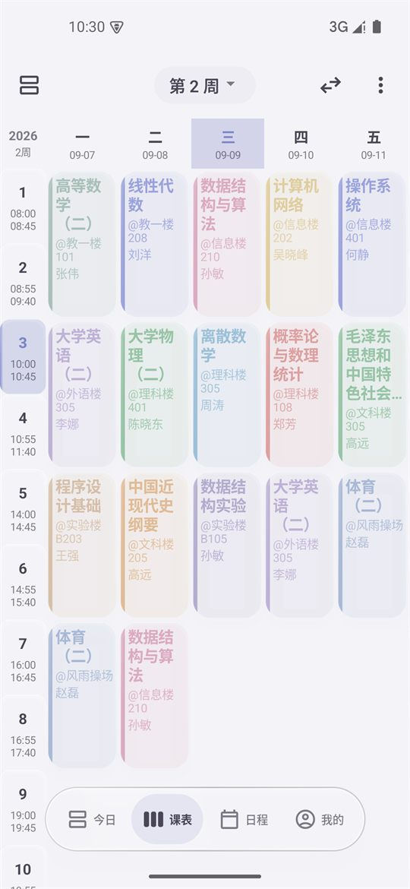 | 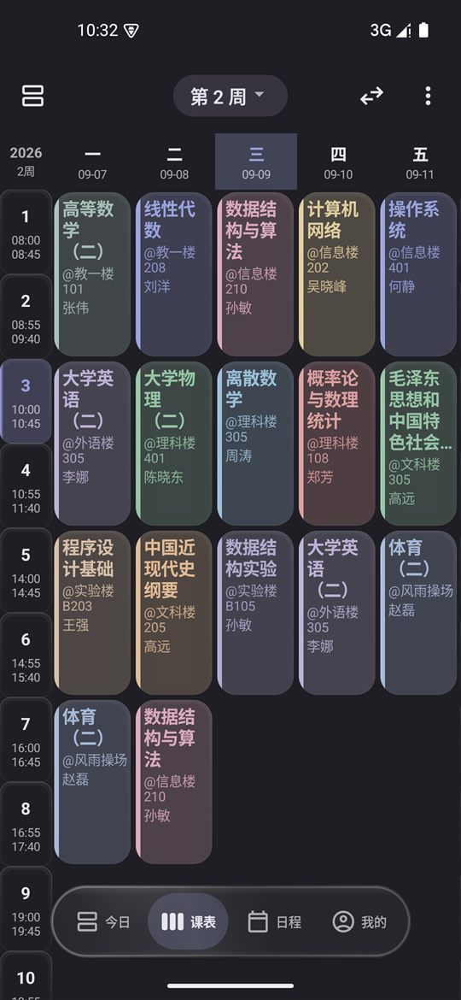 |

> 以上截图取自 **v3.53.5** 正式版（Android 15 模拟器、浅色模式、演示数据），实际界面以最新版为准。

---

## 功能总览

| 模块 | 能力 |
| --- | --- |
| 今日课表 | 当天课程速览、下节课倒计时卡、「正在上课」高亮、下拉刷新、今日待办 |
| 周课表 | 左右滑动切换周次、课程块长按调整、撞色自动修正、隐藏周末 / 非本周课程 |
| 日程 | 日期轴 + 整月日历、待办 / 活动 / 考试 / 作业分类、与今日页完成状态双向同步 |
| 教务导入 | 内置 1700+ 所高校索引、7 类通用适配器、160+ 所学校专属适配脚本、在线安全更新 |
| 情侣课表 | 独立课表：完整编辑、教务 / 文件多形式导入、独立作息、双人同显叠加 |
| 多作息方案 | 夏令时 / 冬令时多方案、按日期自动切换、自定义时间段（编辑后后方节次自动顺延） |
| 学期管理 | 多学期并排管理、点击即设当前学期、状态自动判定、学期进度条 |
| 桌面小组件 | 多尺寸样式、明日预告、深色适配、每日自动更新 |
| 课程提醒 | 课前提醒、上课期间勿扰 / 静音、节假日避开、状态栏灵动岛（Android 16） |
| 备份同步 | JSON 导入导出、ICS 日历导出、系统日历同步、WebDAV 云备份 |
| 个性化 | 书卷 / 通透 / 柔绘三套主题、动态取色、自定义配色与布局、全局动效设置 |

---

## 最近优化

近几个版本围绕「看得清、少打扰、不掉链子」做了集中打磨：

| 版本 | 优化内容 |
| --- | --- |
| v3.53.5 | 修复教务导入「学校列表」页分段控件被撑满整屏、学校列表被挤出屏幕的显示异常 |
| v3.53.4 | 日程页无时间的待办不再显示占位「--:--」；今日页无时间待办卡片铺满整行，版面更干净 |
| v3.53.3 | 情侣叠加视图**默认不再显示课程时间段**（时间文本不再挤占课程卡），需要时可在「情侣课表 → 显示课程时间段」开启 |
| v3.53.2 | 修复老用户升级后启动闪退：数据库迁移补齐 `DEFAULT NULL`，v12 → v13 升级路径恢复可用 |
| v3.53.0 | 自定义时间段「改上一节、后面节次整体顺延」；桌面组件与上课提醒支持**每日零点自愈**（当天不打开 App 也会刷新）；学期管理重写（点击即设当前学期、状态自动判定） |
| v3.52.0 | 情侣课表独立化为独立课表实体：可单独编辑、多形式导入、独立作息、按各自作息排列 |
| v3.51.x | 修复课表切周闪退（玻璃背板渲染树自引用环）；玻璃异常时自动降级兜底 |

---

## 界面构成

内置 **书卷 / 通透 / 柔绘** 三套主题，每套主题同时应用配色、课表样式与专属动效语言：

| 主题 | 设计语言 |
| --- | --- |
| 书卷 | 暖砂纸底 + 赤陶主色，衬线标题，纸页层叠转场（Anthropic 设计系统） |
| 通透 | iOS 26 Liquid Glass 玻璃质感，systemBlue 主色，物理弹簧动效 |
| 柔绘 | 柔和晕染渐变 + 雾紫配色，漫射柔光，零过冲缓动 |

主题与主题模式（跟随系统 / 浅色 / 深色）在「我的 → 外观与样式 → 主题」中切换：

| 外观与样式 | 主题 |
| --- | --- |
| 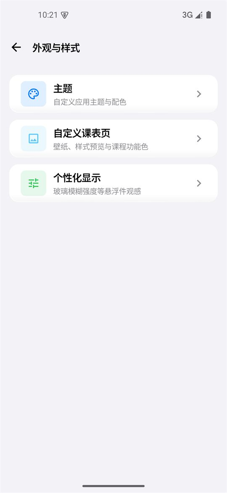 | 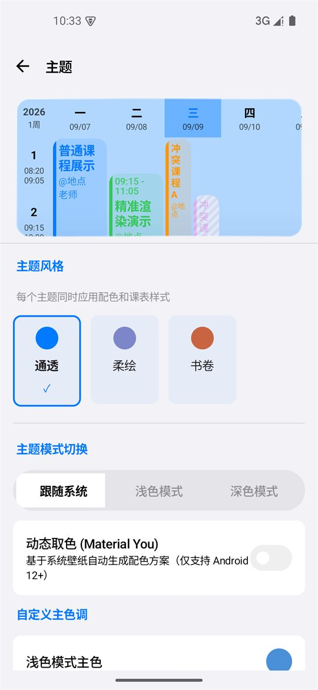 |

---

## 特色功能

### 教务一键导入

离线内置覆盖绝大多数主流教务系统，新用户无需联网即可从校内教务导入课程与作息。

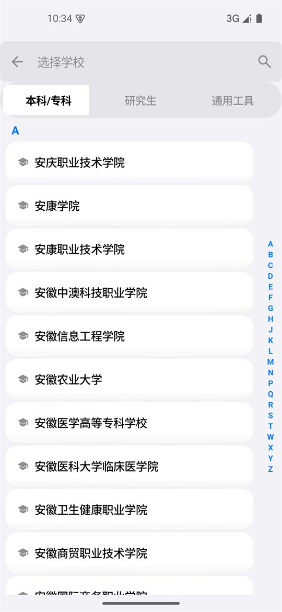

- **1700+ 所高校索引** + **7 类通用教务适配器**（超星、正方、URP、青果、强智、金智、南软等）。
- **160+ 所学校专属适配脚本**，适配特殊教务页面与登录流程（如汕头大学强制电脑版 + 一次点击完成导入、沈阳农业大学 WebVPN 双入口、西安医学院 API 直取等）。
- 学校列表提供本科 / 专科、研究生、通用工具三类分组与 A–Z 字母索引，数千所学校也能秒定位。
- 通用适配器支持桌面 UA + 1280px 视口修复，解决部分学校手机端教务菜单无法打开课表的问题。
- 适配资源支持**在线安全更新**（私有适配仓库 + 逐文件 sha256 校验，校验失败自动回退内置资源，不影响导入）。
- 支持**学期选择**、**一键导航到课表**、验证码 / CAS / WebVPN 等多种登录形态。

### 文件导入 / 导出与同步

教务之外，还提供完整的文件通道：Excel、JSON、ICS、CSV、HTML / TXT 五类导入，以及 JSON / ICS 两种导出。

| 课表导入 / 导出 | 文件导入（多格式） |
| --- | --- |
| 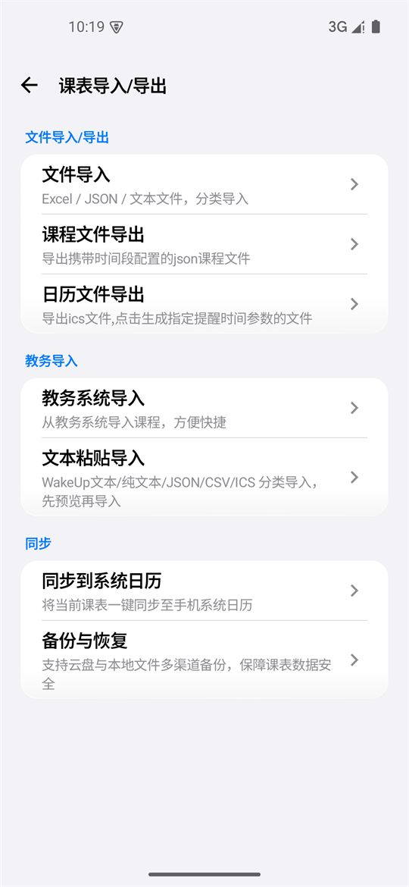 | 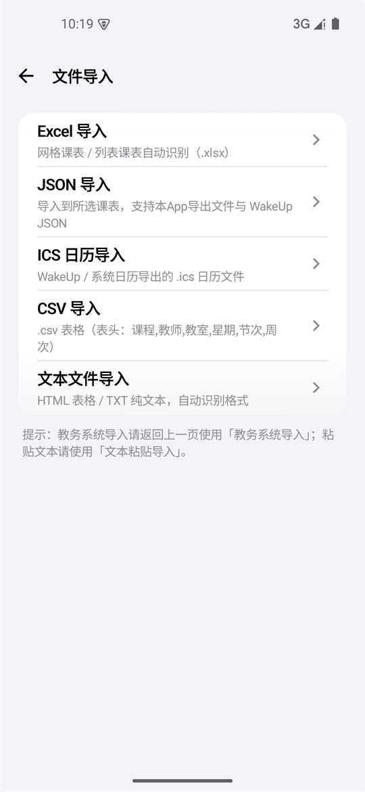 |

- **JSON 导出**携带时间段配置与学期设置，换机 / 重装后一键还原。
- **ICS 导出**可指定提醒时间，导入 iOS / Android / 桌面日历后自带课前提醒。
- 导入前先预览、可逐条编辑，再选择「导入到当前课表 / 存为新课表 / 覆盖」。

### 情侣课表（独立课表）

情侣课表从 v3.52.0 起升级为**独立课表实体**，不再依附本人课表：

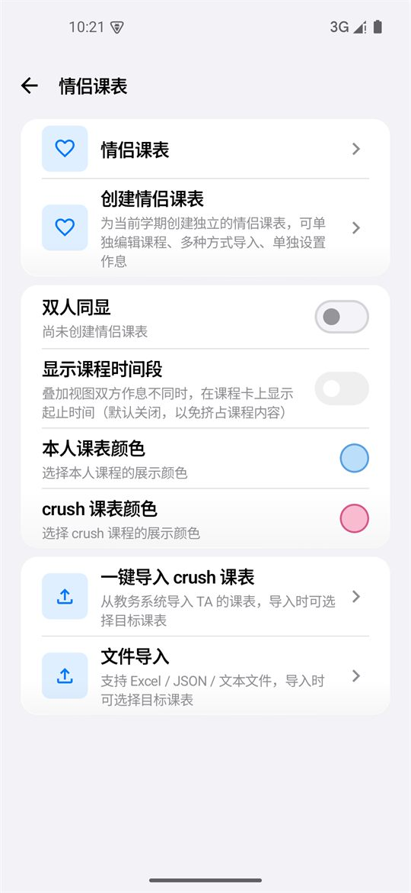

- 拥有独立的课程、作息时间与学期配置；在学期管理页与本人课表并排展示（带 ❤ 标记），支持添加 / 查看 / 重命名 / 删除。
- **完整编辑能力**：点击课程即可修改名称、教师、地点、周次、节次与颜色，也可手动添加课程。
- **多形式导入**：教务系统导入、Excel / JSON / 文本文件导入（导入时选择目标课表即可）。
- **独立作息**：可单独设置 TA 课表的节次时间（含多作息方案）；叠加视图下双方课程分别按各自作息换算位置。
- **叠加显示可选**：课程卡可显示起止时间（如 8:00-9:50）；v3.53.3 起默认关闭，避免时间文本挤占课程内容。
- 可**单独显示**情侣课表；「双人同显」时本人课程优先，冲突检测精确判断周次是否重叠。
- 旧版本已导入的情侣课表数据在升级时自动迁移，备份与恢复完整支持。

### 多作息方案（夏令时 / 冬令时）

一张课表可同时保存多套上课时间，并按日期自动切换，告别每学期手动改时间的麻烦。

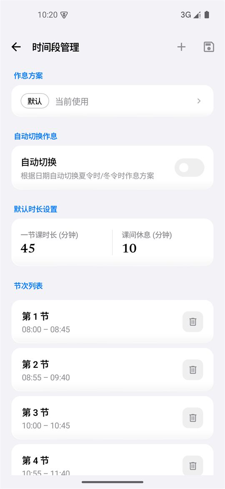

- 多方案切换：默认 / 夏令时 / 冬令时 / 自定义方案。
- 自动切换：按「月-日」生效区间匹配，支持跨年区间（如 `10-01 ~ 次年 04-30`）。
- 时间段管理：可自由增删每一节的时间段，并独立设置「一节课时长」与「课间休息」默认值；**修改某一节结束时间后，后方节次自动整体顺延**，无需逐节手改。

### 学期管理

| 学期管理（多学期并排） | 学期设置 |
| --- | --- |
| 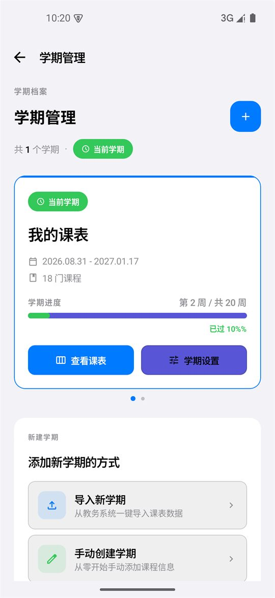 | 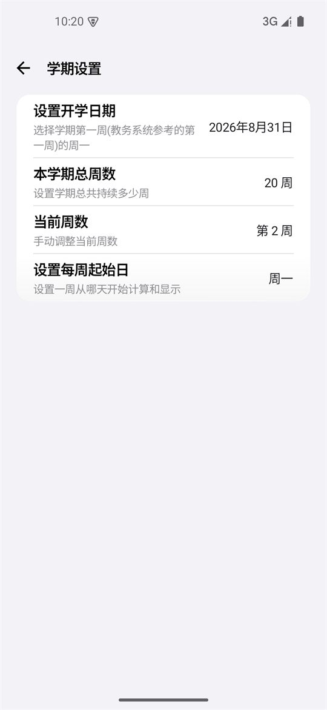 |

- 多学期并排管理，**点击任意学期卡即可把它设为当前学期**（列表实时重排，「查看课表」才跳转课表页）。
- 历史学期状态按日期自动判定（未开始 / 进行中 / 已完成）。
- 当前学期卡带学期进度条（第 N 周 / 共 M 周 · 已过 P%）；长按学期卡可重命名。
- 新建学期支持三种方式：教务导入 / 手动创建 / 备份恢复。

### 日程与待办


- 日程页：日期轴滑动浏览、点击选中；下拉展开整月日历；支持待办 / 活动 / 考试 / 作业 / 其他分类，全天或定时。
- 今日待办：右下角「+」一键添加，支持编辑 / 勾选完成 / 删除；待办默认不带时间，也可自定义具体时间。
- **完成状态双向同步**：今日页勾选的日程 / 待办，在日程页以删除线 + 变淡呈现，反向亦然；待办与日程、课程同屏混排。
- v3.53.4 起：无时间的待办不再显示占位「--:--」，卡片整行铺满。

### 课程管理与结构化课程信息

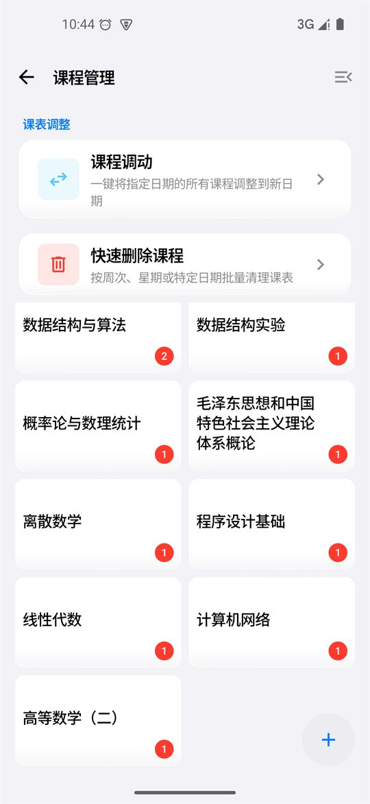

- **课程管理页**：按课程名聚合查看 / 编辑全部课程，并提供「课程调动」（把某天所有课一键调到新日期）与「快速删除课程」（按周次 / 星期 / 指定日期批量清理）。
- 课程支持记录**学分、考核方式、实验课**三个结构化字段，并在导入时从备注文本自动识别：
  - 支持 `学分 / Credit / Score / XF`、`考核方式 / Assessment / ExamType`、`实验课 / Lab / Experiment` 等中英文写法。
  - 例如 `备注：学分 3.5，考核方式：考试，实验课` 会被识别为：学分 `3.5`、考核方式 `考试`、实验课 `是`。
  - 老版本 JSON 缺字段可正常导入，向后兼容；导出会带上新字段。

### 课表排版优化

- **字号自适应缩放**：课程块文字随实际可用宽度动态缩放，窄块不再裁切，宽块更清晰。
- **地点智能换行**：优先在 `@`、`-`、中英文括号等分隔符处换行，避免 `A-302` 被拆成 `A-3 / 02`。
- **信息优先级重排**：按「名称 > 地点 > 教师」取舍，紧凑块自动隐藏次要信息。
- **撞色自动修正**：同名课次统一颜色，不同课程优先分配未占用颜色，课表配色稳定可辨。

### 桌面小组件

- 多种尺寸与样式的桌面 / 锁屏小组件，直出「今天 / 明天」课程概览与当日课程数。
- 深色模式有对应外观，点按可直达课程详情。
- **每日自动更新**：桌面组件与上课提醒无需打开 App，每日零点自动同步课表、重排提醒并刷新小组件。

### 课程提醒与免打扰

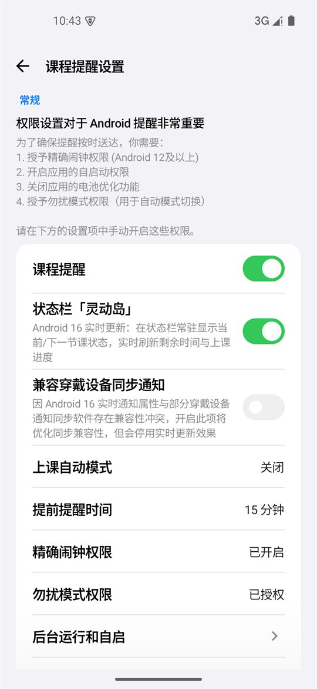

- 上课前自动提醒，支持系统闹钟 / WorkManager 调度。
- 上课期间自动切换**勿扰 (DND) 或静音**，下课自动恢复。
- 内置全年节假日数据，节假日课程不打扰。
- **状态栏灵动岛**（Android 16 实时更新）：常驻显示当前 / 下一节课状态，实时刷新上课进度与剩余时间；按「时间窗口启停」运行（仅在当天第一节课前至最后一节课后），其余时间零常驻、更省电；低版本自动降级为持续通知。

### 备份、迁移与日历同步

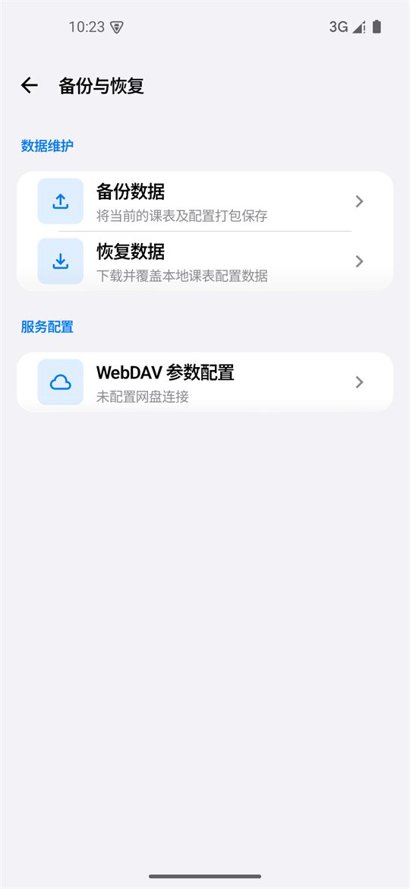

- **JSON 导入/导出**：完整备份与迁移课表及作息（含多方案作息与情侣课表）。
- **ICS 导出**：导入 iOS / Android / 桌面日历，一键对齐系统日历。
- **系统日历同步**：将当前课表写入系统日历账号。
- **WebDAV 云备份**：自托管云端自动备份恢复。

### 个性化外观

- 内置 **书卷 / 通透 / 柔绘** 三种主题风格，每个主题同时应用配色与课表样式，并带各自专属动效语言。
- 主题模式：跟随系统 / 浅色模式 / 深色模式。
- **动态取色 (Material You)**：基于系统壁纸自动生成配色方案（Android 12+）；也可自定义主色调。
- 自定义**背景图片**、格子高度 / 圆角 / 间距 / 透明度；自定义课程块颜色与内容显示样式；课程配色可独立成页管理并一键重置。
- **全局动效系统**：三档「动效速度」倍率 + 九组可独立开关的动画分组 + 「减弱动态效果」无障碍开关；触摸反馈全站覆盖。
- **我的信息页**：头像、昵称、个性签名、学校、学院、专业、年级。

### 多语言

- 简体中文、繁体中文、English，跟随系统自动切换。

---

## 设置（我的）页

「我的」页为设置主入口，按「高频置前、低频后置」组织导航卡片，全部明细功能保留于各二级页：

| 序号 | 入口 | 二级页 / 内容 |
| --- | --- | --- |
| 1 | 我的信息 | 头像、昵称、个性签名、学校、学院、专业、年级 |
| 2 | 课表导入/导出 | 文件导入/导出、教务导入、文本粘贴导入、同步 |
| 3 | 学期设置 | 开学日期、总周数、当前周数、每周起始日、显示非本周课程 / 是否显示周末 |
| 4 | 自定义时间段 | 课程时间段网格编辑（多方案、自动切换、后节顺延） |
| 5 | 管理课表 | 学期管理：多课表切换 / 设为当前 / 重命名 / 删除 |
| 6 | 课程管理 | 按名称查看编辑课程 + 快捷调课 |
| 7 | 情侣课表 | 开关、本人 / TA 配色、导入 / 删除、独立作息设置 |
| 8 | 外观与样式 | 主题、深色模式、课表外观微调、个性化配色、动画效果 |
| 9 | 课程提醒设置 | 常规/高级提醒、免打扰、状态栏灵动岛 |
| 10 | 备份与恢复 | 本地文件 / WebDAV 云备份恢复 |
| 11 | 更多 | 语言、启动页、GitHub、开源许可证、联系作者反馈 |

---

## 构建运行

### 环境要求

- JDK 21（推荐 Android Studio 自带的 JBR）
- Android SDK（`compileSdk` / `targetSdk` / `minSdk` 见 `gradle/libs.versions.toml` 与 `androidApp/build.gradle.kts`）
- Android Studio 或命令行 Gradle

### 命令行

```bash
# 安装 Debug 包到已连接设备
./gradlew :androidApp:installDebug

# 编译 Release APK（按 ABI 拆分，输出到 androidApp/build/outputs/apk/release/）
./gradlew :androidApp:assembleRelease

# 多平台编译检查（公共代码 / 桌面端 / Android）
./gradlew :shared:compileKotlinJvm :desktopApp:compileKotlin :androidApp:assembleDebug
```

Windows 下也可直接运行项目内增强脚本（先按本机路径修改脚本中的 `JAVA_HOME` / `ANDROID_HOME`）：

```bat
run-android.bat
```

> **Release 签名说明**：签名参数外置于项目根目录 `keystore.properties`（已被 git 忽略，不会提交），字段为 `storeFile` / `storePassword` / `keyAlias` / `keyPassword`。请妥善保管签名密钥：它是应用的唯一身份，丢失后将无法对已安装版本增量升级。

## 项目结构

```text
├── androidApp    # Android 应用入口、通知、小组件、教务 WebView
├── desktopApp    # Desktop 桌面端（开发中）
├── iosApp        # iOS 入口（开发中）
├── shared        # Compose Multiplatform 公共代码（UI、数据库、业务逻辑、教务适配资源）
├── picture       # README 界面截图
└── fastlane      # 商店元数据与发布配置
```

## 反馈与教务适配

- **联系作者**：「我的 → 更多 → 联系作者反馈」，或直接发送邮件至 **hhixingchen520@163.com**。
- 欢迎反馈使用问题、希望新增的功能，或请求适配你的学校教务系统。
- **教务适配请求**：请随邮件附上 **学校名称、教务系统账号、教务系统密码**，便于开发者对接调试。

## 版本历史

> 完整更新声明见 **[CHANGELOG.md](./CHANGELOG.md)**（每次发版统一在此追加）；下表为近版速览。

| 版本 | 内容 |
| --- | --- |
| v3.53.5 | 三版合并发布：情侣叠加默认不显示时间段（新增开关）；日程页无时间待办去占位、今日页待办铺满整行；学校列表巨胶囊修复 |
| v3.53.0 | 自定义时段后节自动顺延；组件 / 提醒每日零点自愈；学期管理重写（点击设当前学期、状态自动判定）；待办默认不带时间 |
| v3.52.0 | 情侣课表独立化：独立课表 + 完整编辑 + 教务 / 文件多形式导入 + 独立作息 + 双作息排列 |
| v3.51.0 | 日程页与今日课表联动：完成状态双向同步、今日待办并入日程页 |
| v3.50.x | 液态玻璃底栏重构；「我的信息」页；Android 15+ 玻璃闪退自愈兜底 |
| v3.47.0 | 下节课卡三选一（自动下一次 / 已结束变淡 / 消失），跨天日程纳入 |
| v3.45.0 | 日程页日期面板：左右滑动切日期、切月联动、下拉展开整月日历 |
| v3.43.0 | 交互动效全面分档：三套主题各自动效语言、触摸反馈全站覆盖、减弱动态效果开关 |
| v3.42.0 | 新增「柔绘」主题 |
| v3.41.0 | 「通透」重做为 iOS 26 Liquid Glass，主题精简为书卷 / 通透 |
| v3.40.0 | 学期管理页 + 时间段管理页全新设计 |
| v3.38.0 | 教务适配私有化 + 远程安全更新（sha256 校验、失败静默回退内置资源） |
| v3.33.0 | 「书卷」主题落地 + 新增「日程」模块（第四 Tab） |
| v3.28.0 | iOS 风格全面改版「通透」主题 |
| v3.22.0 | 毛玻璃质感全局改版（Telegram 形态） |
| v3.15.1 | 状态栏灵动岛完整版（Android 16 ProgressStyle + 时间窗口启停） |
| v3.13.1 | 今日课表新增「今日待办」 |

## 许可证与致谢

本项目基于 [Apache License 2.0](./LICENSE) 开源。

项目的最初形态演进自 [拾光课程表（shiguangschedule）](https://github.com/XingHeYuZhuan/shiguangschedule) 的 Apache-2.0 开源代码，后续经过大量重构与功能扩展，感谢原作者提供的框架以及大量宝贵代码，谨此致谢原项目及全体贡献者。
