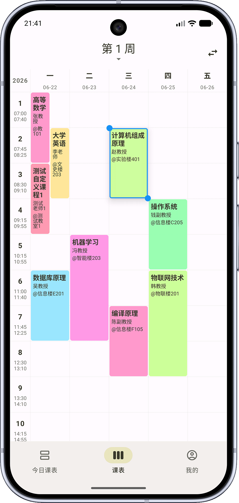
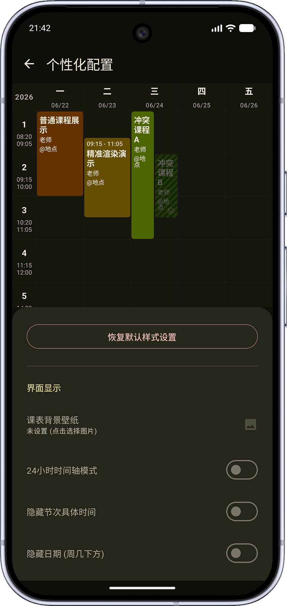
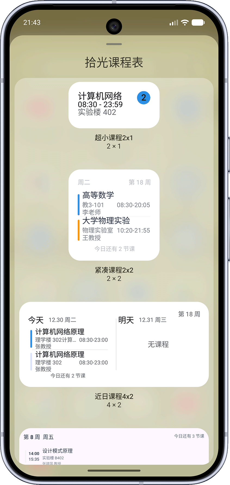
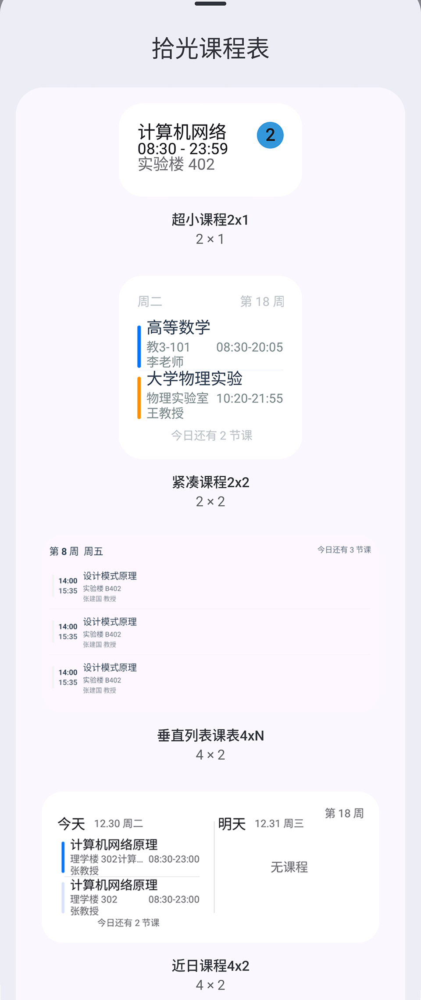

# 上课 · ShangKeSchedule

> 一款面向中国高校场景的开源课表 App（Kotlin Multiplatform + Compose）。
> 一个应用解决：**课程表、多作息方案、情侣课表、教务一键导入、桌面小组件、课程提醒与备份**。
> Android 为正式版本，Desktop 与 iOS 正在开发中。


## ✨ 特色功能

### 📐 课表排版优化

- **字号自适应缩放**：课程块文字随实际可用宽度动态缩放（约 72%～115%），窄块不再裁切，宽块更清晰。
- **地点智能换行**：优先在 `@`、`-`、中英文括号等分隔符处换行，避免 `A-302` 被拆成 `A-3 / 02`。
- **信息优先级重排**：按「名称 > 地点 > 教师」取舍，紧凑块自动隐藏次要信息，核心内容始终完整可读。

### 🕒 多作息方案（夏令时 / 冬令时）

一张课表可同时保存多套上课时间，并按日期自动切换，告别每学期手动改时间的麻烦。

- 多方案切换：默认 / 夏令时 / 冬令时 / 自定义方案。
- 自动切换：按「月-日」生效区间匹配，支持跨年区间（如 `10-01 ~ 次年 04-30`）。
- 新建方案自动复制当前方案的全部时间段，微调即可；默认方案不可误删。

### 💑 情侣课表 / 课表对比

把 TA 的课表与自己并存展示，情侣、室友或需要对照排课时都适用。

- 通过教务适配或 JSON 文件导入 crush 课表，与本人课程数据隔离、互不覆盖作息。
- 周课表 / 今日课表叠加展示，可分别设置「本人颜色」与「crush 颜色」。
- 时间冲突时本人课程优先左列、crush 右列；冲突检测会精确判断周次是否重叠。
- crush 课程详情仅展示、不提供编辑，防止误改 TA 的课表。

### 🎓 结构化课程信息

课程支持记录**学分、考核方式、实验课**三个结构化字段，并在导入时从备注文本自动识别：

- 支持 `学分 / Credit / Score / XF`、`考核方式 / Assessment / ExamType`、`实验课 / Lab / Experiment` 等中英文写法。
- 例如 `备注：学分 3.5，考核方式：考试，实验课` 会被识别为：学分 `3.5`、考核方式 `考试`、实验课 `是`。
- 老版本 JSON 缺字段可正常导入，向后兼容；导出会带上新字段。

### 🏫 内置教务导入适配

离线内置覆盖绝大多数主流教务系统，新用户无需联网即可从校内教务一键导入课程与作息。

- **1542 所高校**清单 + **10 类通用教务适配器**（正方、强智、金智、智慧树、超星、URP 等）。
- 另有 **174 个院校专属适配脚本**，适配特殊教务页面与登录流程。
- 提供 `sync_warehouse.ps1` 一键增量/全量同步最新适配脚本与编译好的学校索引。
- 离线资源带 `size + hash` 校验，适配更新后自动重新解压，不重复初始化。

### 📱 桌面小组件

- 多种尺寸与样式的桌面 / 锁屏小组件，直出「今天 / 明天」课程概览与当日课程数。
- 深色模式下小组件有对应外观，点按可直达课程详情。

### 🔔 课程提醒与免打扰

- 上课前自动提醒，支持系统闹钟 / WorkManager 调度。
- 上课期间自动切换**勿扰 (DND) 或静音**，下课自动恢复。
- 内置全年节假日数据，节假日课程不打扰。

### ☁️ 备份、迁移与日历同步

- **JSON 导入/导出**：完整备份与迁移课表及作息。
- **ICS 导出**：导入 iOS / Android / 桌面日历，一件对齐系统日历。
- **系统日历同步**：将当前课表写入系统日历账号。
- **WebDAV 云备份**：自托管云端自动备份恢复。

### 🎨 个性化

- 自定义**背景图片**、格子高度 / 圆角 / 间距 / 透明度。
- 自定义课程块颜色与内容显示样式；情侣课表可分别配色。
- 内置主题预设（含「利落」等高对比度样式）与**深色模式**。

### 🌏 多语言

- 简体中文、繁体中文、English，跟随系统自动切换。

## 核心功能一览

| 模块 | 能力 |
| --- | --- |
| 今日课表 | 当天课程速览，含「正在上课」高亮与列表页切换 |
| 周课表 | 左右滑切换周次、点击顶部周次快速跳转、长按课程块调整位置或高度 |
| 课表配置 | 开学日期、总周数、当前周数、每周起始日、显示周末 / 非本周课程 |
| 桌面小组件 | 多尺寸样式、明日预告、深色外观 |
| 课程提醒 | 课前提醒、自动勿扰 / 静音、节假日避开 |
| 导入导出 | 教务导入、JSON、ICS、系统日历、WebDAV |

## 预览

| 周课表（长按可调课程块位置/高度） | 个性化配置（背景 / 24 时制 / 隐藏节假日等） | 桌面小组件 | 课程详情 |
| :---: | :---: | :---: | :---: |
|  |  |  |  |

## 构建运行

### 环境要求

- JDK 21（推荐 Android Studio 自带的 JBR）
- Android SDK（`compileSdk` 与版本见 `androidApp/build.gradle.kts`）
- Android Studio 或命令行 Gradle

### 命令行

```bash
# 安装 Debug 包到已连接设备
./gradlew :androidApp:installDebug

# 编译 Release APK（按 ABI 拆分，输出到 androidApp/build/outputs/apk/release/）
./gradlew :androidApp:assembleRelease
```

Windows 下也可直接运行项目内增强脚本（先按本机路径修改脚本中的 `JAVA_HOME` / `ANDROID_HOME`）：

```bat
run-android.bat
```

> **Release 签名说明**：签名参数外置于项目根目录 `keystore.properties`（已被 git 忽略，不会提交），字段为 `storeFile` / `storePassword` / `keyAlias` / `keyPassword`。请妥善保管签名密钥：它是应用的唯一身份，丢失后将无法对已安装版本增量升级。

## 同步离线教务适配仓库

```powershell
.\sync_warehouse.ps1            # 增量同步
.\sync_warehouse.ps1 -Clean     # 完全镜像，覆盖本地适配目录
```

脚本会自动下载适配脚本与编译好的 `school_index.pb`，同步完成即生效。

## 项目结构

```text
├── androidApp    # Android 应用入口、通知、小组件
├── desktopApp    # Desktop 桌面端（开发中）
├── iosApp        # iOS 入口（开发中）
├── shared        # Compose Multiplatform 公共代码（UI、数据库、业务逻辑）
├── fastlane      # 商店元数据与发布配置
└── sync_warehouse.ps1
```

## 许可证与致谢

本项目基于 [Apache License 2.0](./LICENSE) 开源。

项目的最初形态演进自 [拾光课程表（shiguangschedule）](https://github.com/XingHeYuZhuan/shiguangschedule) 的 Apache-2.0 开源代码，后续经过大量重构与功能扩展，谨此致谢原项目及全体贡献者。
